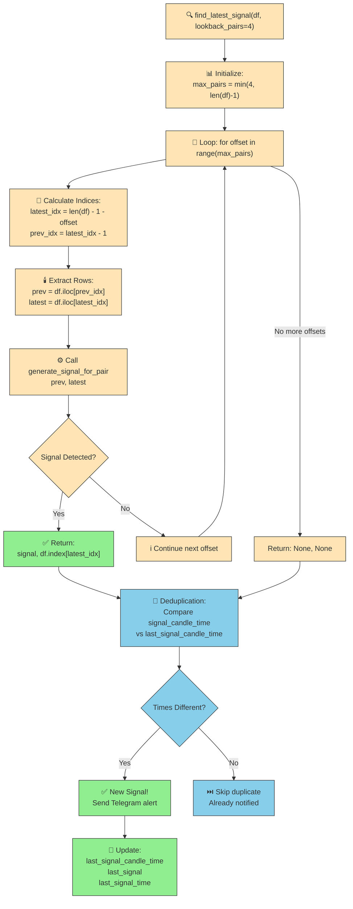
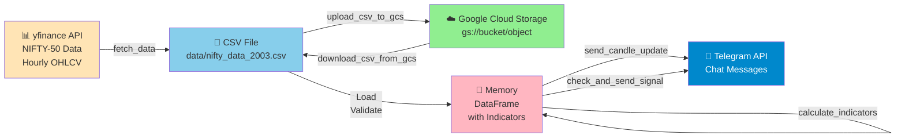
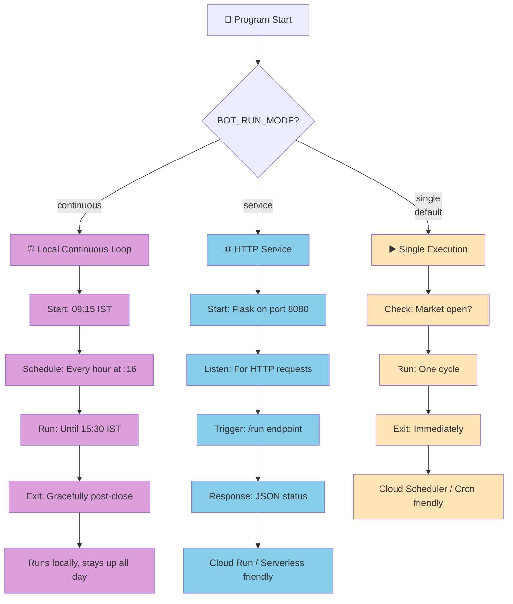

# Nifty Trading Bot - Detailed Flow Diagram

## Complete System Architecture

```mermaid
flowchart TD
    Start([🚀 Program Start]) --> LoadConfig["📋 load_sensitive_config<br/>Load Telegram Token & Chat ID"]
    LoadConfig --> CheckMode{🔀 Check BOT_RUN_MODE<br/>Environment Variable}
    
    %% Continuous Mode
    CheckMode -->|continuous| ContinuousSetup["⏰ run_continuous_bot()"]
    ContinuousSetup --> MktCheck1{📅 Market Open<br/>09:15-15:30 IST?}
    MktCheck1 -->|No| ErrorMsg["❌ Market CLOSED<br/>Raise ValueError"]
    ErrorMsg --> SendErr["📤 Send Telegram Error"]
    SendErr --> Exit1([❌ Exit])
    
    MktCheck1 -->|Yes| LogStart["✅ Startup Message"]
    LogStart --> InitSetup1["🔧 initial_setup()"]
    InitSetup1 --> ScheduleConfig["⏱️ Schedule job every hour<br/>at :16 minutes"]
    ScheduleConfig --> MainLoop["🔄 Main Scheduler Loop"]
    
    %% Service Mode - HTTP
    CheckMode -->|service| HttpSetup["🌐 run_http_service()"]
    HttpSetup --> Flask["🍶 Start Flask Server<br/>Port 8080"]
    Flask --> EndpointReady["📡 Endpoints Ready:<br/>/ → Home<br/>/healthz → Health<br/>/run → Trigger"]
    EndpointReady --> ListenHttp["⏳ Listen for HTTP Requests"]
    
    %% Single Mode
    CheckMode -->|single<br/>default| SingleSetup["▶️ run_single_cycle()"]
    
    %% HTTP Trigger Path
    ListenHttp -->|GET/POST /run| HttpTrigger["🔔 trigger_run()"]
    HttpTrigger --> AcquireLock{"🔐 Acquire run_lock<br/>non-blocking?"}
    AcquireLock -->|Already Running| ReturnBusy["⚠️ Return 409<br/>Already in progress"]
    ReturnBusy --> HttpEnd([HTTP Response])
    AcquireLock -->|Lock Acquired| RunDetails["📊 run_single_cycle_with_details()"]
    
    %% Continuous Job Flow
    MainLoop --> CheckTime{⏰ Time Check}
    CheckTime -->|Before 15:30| ScheduleRun["🕐 schedule.run_pending()"]
    ScheduleRun --> Sleep["😴 Sleep 60s"]
    Sleep --> CheckTime
    CheckTime -->|After 15:30| CloseMarket["🔴 Market Close Time"]
    CloseMarket --> SendClose["📤 send_market_closed_alert()"]
    SendClose --> Exit2([✅ Bot Exit])
    
    %% Single & Service Job ExecutionA
    SingleSetup --> RunCycle
    RunDetails --> RunCycle["▶️ run_single_cycle()"]A
    MainLoop -->|Hour schedule| Job["📍 job()"]
    Job --> RunCycle
    
    %% Job Execution Pipeline
    RunCycle --> Download["☁️ download_csv_from_gcs()<br/>If GCS configured"]
    Download --> CheckMktOpen{🕒 Market Open?<br/>09:15-15:30}
    CheckMktOpen -->|No| ReturnZero["⏭️ Return 0<br/>Skip execution"]
    CheckMktOpen -->|Yes| FetchData["📥 fetch_data()<br/>Fetch 2 days hourly OHLC<br/>from yfinance"]
    
    FetchData --> SaveData["💾 update_csv()<br/>Merge new data<br/>Remove duplicates<br/>Sort by time"]
    SaveData --> GCSUpload["☁️ upload_csv_to_gcs()<br/>Sync to GCS if configured"]
    
    GCSUpload --> LoadFull["📂 Load Full CSV<br/>from Disk"]
    LoadFull --> Validate["✔️ Validate Data<br/>Convert to numeric<br/>Remove NaN"]
    Validate --> CalcInd["📈 calculate_indicators()"]
    
    %% Indicator Calculation
    CalcInd --> CheckLen{Data >= 100<br/>rows?}
    CheckLen -->|No| ReturnEmpty1["⚠️ Not enough data<br/>Return Empty DF"]
    CheckLen -->|Yes| EMA7["🔵 EMA7 = Fast MA"]
    EMA7 --> EMA14["🟢 EMA14 = Slow MA"]
    EMA14 --> SMA100["🟡 SMA100 = Trend Filter"]
    SMA100 --> DropNa["🧹 Drop NaN rows"]
    DropNa --> IndicReady["✅ Indicators Ready"]
    
    ReturnEmpty1 --> Exit3([End Job])
    
    %% Candle Update
    IndicReady --> SendCandle["🕯️ send_candle_update()"]
    SendCandle --> GetLatest["📊 Get last candle"]
    GetLatest --> FormatCandle["✍️ Format Message:<br/>🕯️ NIFTY Candle Update<br/>Close: {price}<br/>Time: {candle_time}"]
    FormatCandle --> SendTg1["📤 send_telegram_alert()"]
    SendTg1 --> CheckSignal["⚡ check_and_send_signal()"]
    
    %% Signal Detection with Lookback
    CheckSignal --> FindLatest["🔍 find_latest_signal()"]
    FindLatest --> ListCheck{len(df) >= 2?}
    ListCheck -->|No| ReturnNone["Return None, None"]
    ListCheck -->|Yes| CalcMax["max_pairs = min(4, len-1)"]
    
    CalcMax --> LookbackLoop["🔁 For offset in range(max_pairs)<br/>Scan last 4 candle pairs"]
    LookbackLoop --> GetPair["🕯️ Get prev & latest<br/>candle pair"]
    GetPair --> GenSignal["⚙️ generate_signal_for_pair()"]
    
    %% Signal Generation Logic
    GenSignal --> CheckBuy{"💚 BUY Signal?<br/>prev.ema_fast <= ema_slow<br/>AND latest.ema_fast > ema_slow<br/>AND both > SMA100"}
    CheckBuy -->|Yes| RetBuy["✅ Return: BUY<br/>& candle_time"]
    CheckBuy -->|No| CheckSell
    
    CheckSell{"❤️ SELL Signal?<br/>prev.ema_fast >= ema_slow<br/>AND latest.ema_fast < ema_slow<br/>AND both < SMA100"}
    CheckSell -->|Yes| RetSell["✅ Return: SELL<br/>& candle_time"]
    CheckSell -->|No| CheckExit
    
    CheckExit{"🟡 EXIT Signal?<br/>EMA crossover detected"}
    CheckExit -->|Yes| RetExit["✅ Return: EXIT<br/>& candle_time"]
    CheckExit -->|No| NextOffset["➡️ Next offset"]
    NextOffset --> LookbackLoop
    
    RetBuy --> SignalFound
    RetSell --> SignalFound
    RetExit --> SignalFound
    ReturnNone --> SignalFound{Signal & Time<br/>from lookback?}
    
    %% Deduplication Check
    SignalFound -->|Yes| DedupCheck{"🔐 Candle time != <br/>last_signal_candle_time?<br/>Prevent duplicate"}
    SignalFound -->|No| NoSignal["ℹ️ No signal"]
    
    DedupCheck -->|Already Sent| SkipDup["⏭️ Skip duplicate"]
    DedupCheck -->|New Signal| GetPrice["💰 Get price from<br/>signal candle"]
    
    GetPrice --> TzConvert["🌍 Convert to IST<br/>Timezone"]
    TzConvert --> GetEmoji["😊 Get Signal Emoji:<br/>BUY→🟢📈<br/>SELL→🔴📉<br/>EXIT→🟡🚪"]
    GetEmoji --> BuildMsg["✍️ Build Message:<br/>{emoji} NIFTY SIGNAL: {signal}<br/>Price: {price}<br/>Candle Time: {time}"]
    BuildMsg --> SendTg2["📤 send_telegram_alert()<br/>Retry logic up to 3 times"]
    SendTg2 --> UpdateGlobal["📌 Update Global State:<br/>last_signal = signal<br/>last_signal_time = now<br/>last_signal_candle_time = candle_time"]
    UpdateGlobal --> LogSignal["📝 Log: New signal generated"]
    
    SkipDup --> JobEnd
    NoSignal --> JobEnd
    LogSignal --> JobEnd([✅ Job Complete])
    
    Exit3 --> JobEnd
    
    %% Exception Handling
    SendTg2 -->|Error| TgError["⚠️ Log Telegram error<br/>Continue anyway"]
    TgError --> UpdateGlobal
    
    %% Response to HTTP caller
    RunCycle -->|Success| HttpSuccess["✅ Return 200<br/>status: completed"]
    RunCycle -->|Failure| HttpFail["❌ Return 500<br/>status: failed"]
    HttpSuccess --> HttpEnd
    HttpFail --> HttpEnd
    ReturnZero --> HttpSkipped["⏭️ Return 200<br/>status: skipped"]
    HttpSkipped --> HttpEnd
    
    %% Styles
    classDef startEnd fill:#90EE90,stroke:#333,stroke-width:2px
    classDef process fill:#87CEEB,stroke:#333,stroke-width:2px
    classDef decision fill:#FFD700,stroke:#333,stroke-width:2px
    classDef telegram fill:#0088cc,stroke:#333,stroke-width:2px,color:#fff
    classDef signal fill:#FFB6C1,stroke:#333,stroke-width:2px
    classDef error fill:#FFB6C6,stroke:#333,stroke-width:2px
    
    class Start,Exit1,Exit2,Exit3,JobEnd,HttpEnd startEnd
    class LoadConfig,FetchData,SaveData,LoadFull,CalcInd,EMA7,EMA14,SMA100,SendCandle,GetLatest,GetPair,GenSignal,GetPrice,TzConvert,BuildMsg,LogSignal process
    class CheckMode,MktCheck1,AcquireLock,CheckMktOpen,CheckLen,ListCheck,LookbackLoop,CheckBuy,CheckSell,CheckExit,SignalFound,DedupCheck,CheckTime decision
    class SendTg1,SendTg2,SendErr,SendClose telegram
    class RetBuy,RetSell,RetExit signal
    class ErrorMsg,ReturnEmpty1,ReturnZero,SkipDup error
```

---

## Signal Detection Deep Dive



---

## Data Flow Architecture



---

## Execution Modes Comparison



---

## Key Features

### 🔐 Signal Deduplication Strategy
- **Problem**: Bot downtime causes missed signals
- **Solution**: Scan last 4 hourly candle pairs on each run
- **Tracking**: Store `last_signal_candle_time` timestamp
- **Result**: Catches signals even after hours of downtime

### 🕯️ Candle-Time Deduplication
- **Every Run**: Sends current candle close + time
- **Signal Alert**: Only sent if candle time is new
- **Prevents**: Duplicate notifications from multiple runs on same candle

### 🌐 Multi-Mode Deployment
- **Local**: Continuous loop with scheduler
- **Cloud Run**: HTTP service, stateless, event-driven
- **Cloud Scheduler**: Hourly cron triggers single runs

### 📱 Telegram Integration
- **Real-time**: Emoji-enriched alerts (BUY 🟢📈, SELL 🔴📉, EXIT 🟡🚪)
- **Candle Data**: Close price + timestamp IST
- **Retry Logic**: Up to 3 retries with exponential backoff
- **Error Handling**: Logs all Telegram failures, continues anyway

### 🛡️ Thread Safety
- **Lock**: `run_lock` prevents concurrent job execution
- **Prevention**: 409 Conflict if /run called while running
- **Safety**: Safe for Cloud Run concurrent requests

---

## How to Convert to Image

### Option 1: Online Tools
1. Copy the Mermaid code blocks above
2. Visit: https://mermaid.live
3. Paste the code → Export as PNG/SVG

### Option 2: Local Tools (Mermaid CLI)
```bash
npm install -g @mermaid-js/mermaid-cli
mmdc -i TRADING_BOT_FLOW_DIAGRAM.md -o trading_bot_flow.svg
```

### Option 3: VS Code
- Install "Markdown Preview Mermaid Support" extension
- Open this file → Preview diagram → Screenshot

---

## File Generated
📄 **Location**: `TRADING_BOT_FLOW_DIAGRAM.md`
📍 **Workspace**: `c:\Users\Aakash_Doshi\Desktop\Shoonya\ShoonyaApi-py-master\ShoonyaApi-py-master\`
